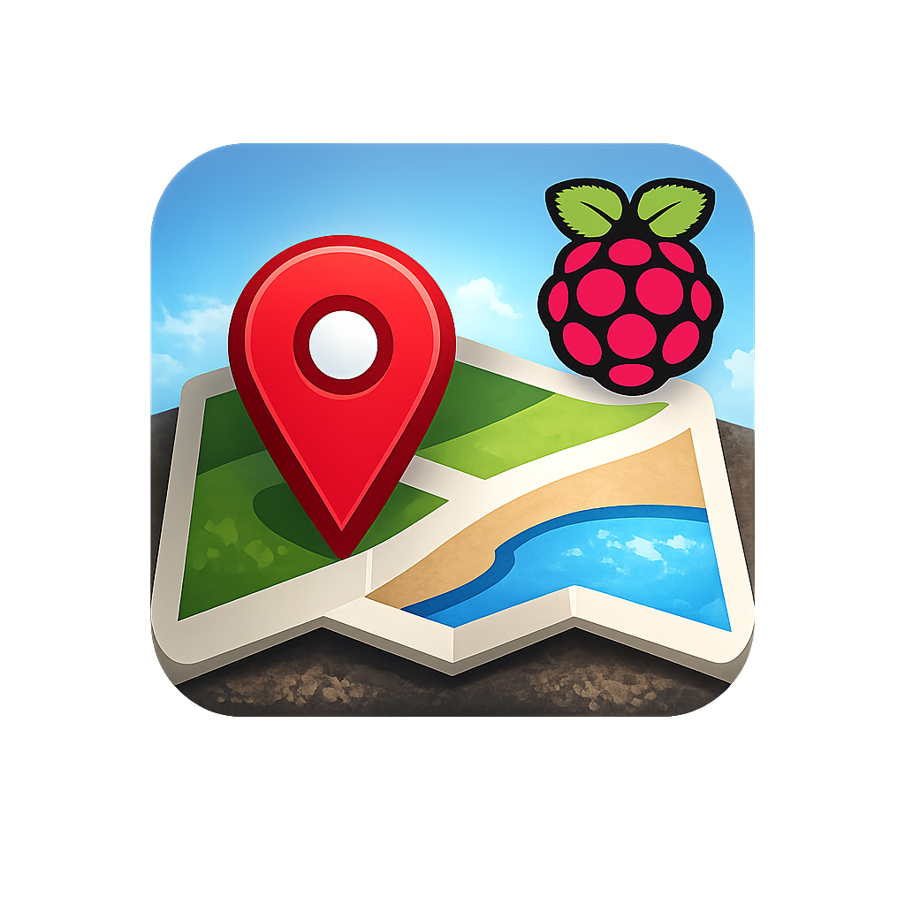
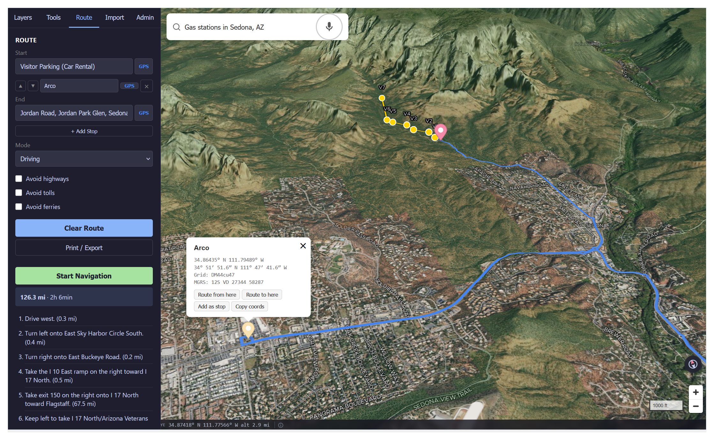
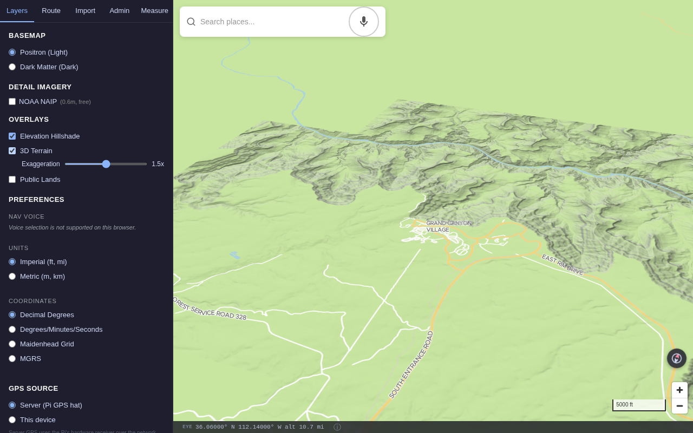
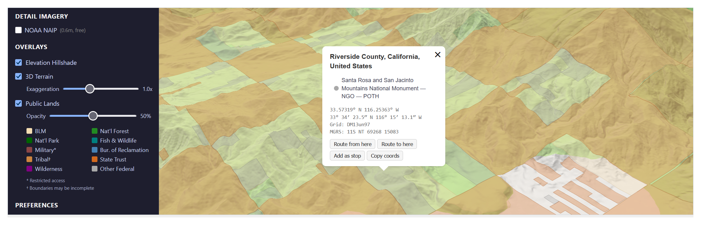
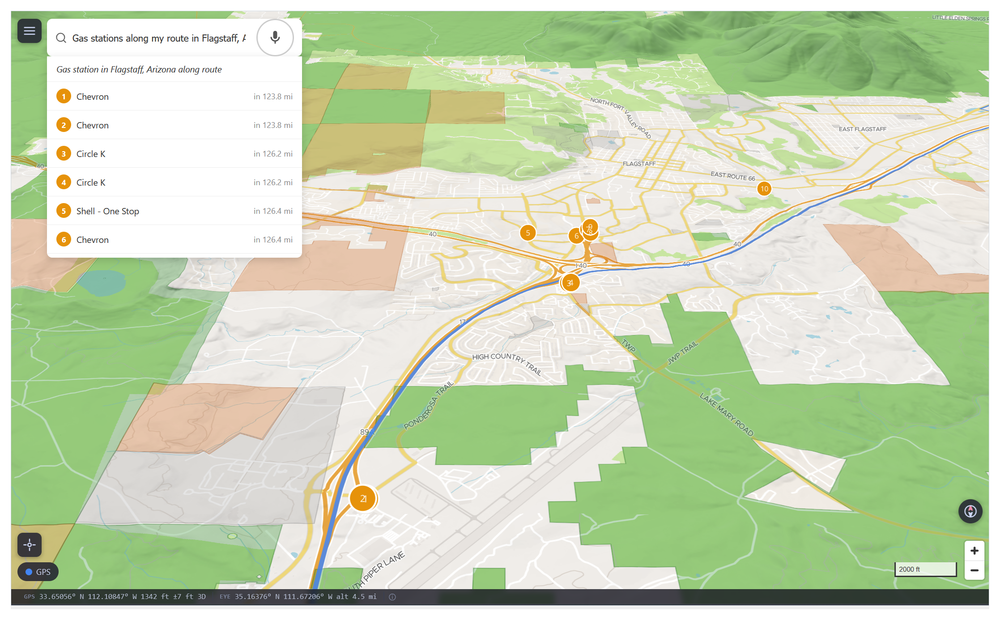
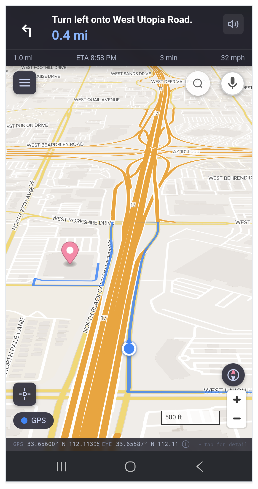
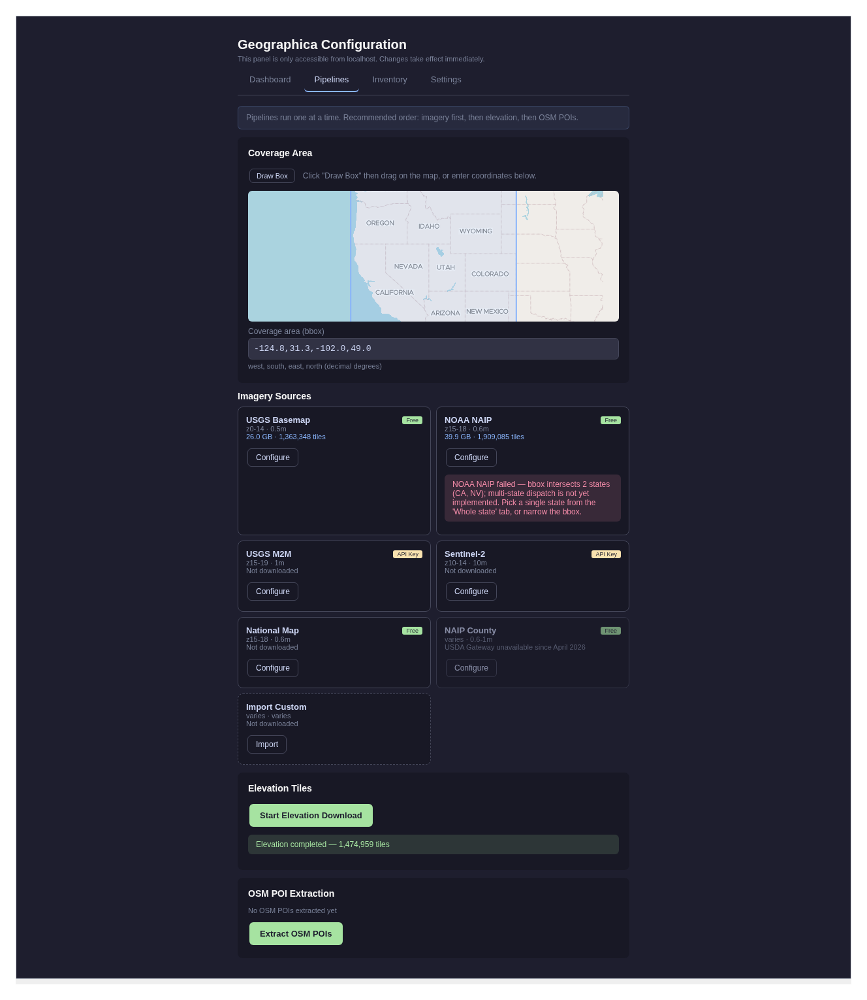
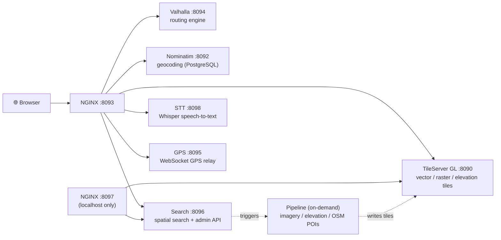

<!-- HEADER -->


# Geographica

**Offline-first GIS platform for field operations on disconnected networks.** A complete mapping stack — vector basemaps, aerial imagery, terrain, routing, geocoding, GPS — running on a single Raspberry Pi 5.

[](LICENSE)
[](CHANGELOG.md)
[](https://github.com/cameronzucker/geographica/actions/workflows/frontend-ci.yml)
[](#)
[](docs/PROCESS.md)
[](docs/PROCESS.md)

<br clear="left" />

<!-- ONE-PARAGRAPH ELABORATION -->
Built for [AREDN](https://www.arednmesh.org/) mesh networks and field teams operating without cloud connectivity. Acquire data once on a connected workstation, then deploy anywhere — wilderness, disaster recovery, off-grid bases, or mesh-network coverage areas. After initial data acquisition, no internet connection is required.

<!-- HERO SCREENSHOT -->
<p align="center">

</p>

<!-- HOW IT WAS BUILT CALLOUT -->
> **How it was built:** 19 days. One engineer plus a team of Claude agents working under structured agent-orchestration patterns — brainstorm, adversarial review, TDD execution by parallel sub-agents. Inference cost: **~$300 of API-equivalent model output**, paid as a Claude Max subscription (~$200/mo). [Read the process →](docs/PROCESS.md) · [Cost methodology →](docs/COST_METHODOLOGY.md)

## Features

<p align="center">

<br>
<em>3D terrain with hillshade — one of three rendering modes for any region.</em>
</p>

### Mapping & imagery



- **Vector basemaps** — three themes (Positron light, Dark Matter dark, Hybrid imagery+roads) with house-number labels.
- **Aerial imagery** — five acquisition modes (USGS Direct, NOAA NAIP, National Map ImageServer, USGS M2M API, BYO GeoTIFF). Per-source toggles, opacity slider, dynamic basemap restyling when imagery is active.
- **Public lands layer** — BLM, National Forest, National Park, Fish & Wildlife, Military, Bureau of Reclamation, Tribal, State Trust, and Wilderness boundaries. Agency-colored fills, tribal-boundary diagonal stripes, full legend.
- **3D terrain** — hillshade overlay, adjustable exaggeration slider, free-look camera (pitch/bearing control).

<br clear="right" />

### Spatial intelligence



- **Natural-language spatial search** — "nearest gas station", "hospitals near me", "gas stations along my route", "fuel every 50 miles", "gas stations in Flagstaff", "restaurants in Phoenix along my route". Distance-ranked results, numbered map pins, city-aware geocoding.
- **Voice search** — push-to-hold mic button for hands-free queries via Whisper (base.en, CPU). Requires HTTPS.
- **OSM POI search** — commercial amenities (fuel, food, lodging, pharmacy, grocery) and public-land boundaries extracted from OSM data.
- **Geocoding** — Nominatim-backed search for addresses, cities, landmarks.
- **POI search** — GNIS gazetteer with full-text search.

<br clear="right" />

### Navigation & GPS



- **Turn-by-turn navigation** — voice guidance, off-route detection, dead reckoning.
- **Multi-stop waypoint routing** — map-click point selection for car, bicycle, and pedestrian profiles.
- **Live GPS** — hardware GPS streaming over WebSocket with accuracy circle display.
- **KML/KMZ import** — drag-and-drop file overlay with layer management panel and IndexedDB session persistence.
- **Coordinate display** — Maidenhead grid locator and MGRS in addition to lat/lon.
- **Imperial and metric units** — switchable distance/elevation units.
- **Print/export directions** — Mapquest-style printable page.

<br clear="right" />

### Operations & admin



- **Admin config panel** (localhost-only, separated from main app) — 4-tab layout with Dashboard (service health, disk/TLS info), Pipelines (7-source card grid with MapLibre minimap bbox selection), Inventory (imagery coverage map with clustered markers), Settings (credential keyring, TLS config, STT status).
- **Pipeline management** — start/cancel imagery (5 modes), elevation, public lands, and OSM POI extraction from the browser, with phase-aware progress tracking and quad-level deduplication.
- **ATAK integration** — serves as a WMS map source for TAK clients.
- **TLS support** — three modes (HTTP, HTTPS self-signed, Tailscale Let's Encrypt).
- **Credential security** — API keys stored in GNOME Keyring via host-side daemon, shared with containers over tmpfs (no plaintext credential files).
- **No build step** — vanilla JS + MapLibre GL JS frontend, no bundler required.

<br clear="right" />

## Architecture



Seven persistent Docker Compose services plus an on-demand pipeline container, with per-container memory limits to prevent OOM on constrained hardware. NGINX reverse-proxies all services behind a single port with URL rewriting for TileServer GL style/TileJSON endpoints. The configuration NGINX (port 8097) is bound to localhost only and serves the admin panel + pipeline-management API; the main NGINX (port 8093) serves the user-facing app.

The on-demand pipeline container runs imagery acquisition, elevation tile downloads, and OSM POI extraction. It writes new tiles into the data volume, and TileServer GL hot-reloads its config to pick them up without a restart.

## Hardware requirements

| Component | Minimum | Recommended |
|-----------|---------|-------------|
| Board | Raspberry Pi 5, 8 GB | Raspberry Pi 5, 16 GB |
| Storage | 256 GB SSD (single-state coverage) | 1 TB SSD (multi-state coverage) |
| GPS | — | Any gpsd-compatible receiver: Waveshare LC29H HAT, USB GPS dongle (u-blox, BU-353S4), etc. |
| NPU | — | Hailo 10H (for future NPU-accelerated STT) |

**Tested on:** Pi 5 16 GB, Debian Trixie (bookworm also works), Intel D3-S4610
896 GB SATA SSD.

**Storage budget** (Western US, 11 states):

| Dataset | Size |
|---------|------|
| Vector basemap (OpenMapTiles via Planetiler) | ~2.4 GB |
| Elevation tiles (zoom 0-14) | ~70-120 GB |
| Aerial imagery — scraper z0-z14 (USGS tile cache) | ~25 GB |
| Aerial imagery — NAIP z17 (NOAA, per region) | ~10-50 GB |
| Public lands (PAD-US + Census AIANNH tribal) | ~0.4 GB |
| OSM extracts (merged PBF) | ~3.1 GB |
| Valhalla routing graph | ~4.3 GB |
| Nominatim geocoding DB | ~30-40 GB |
| POI index (GNIS + OSM) | ~80 MB |
| **Total** | **~145-320 GB** |

Imagery size varies by region. z0-z14 scraper covers the full region at ~25 GB.
NOAA NAIP imagery is ~21 MB per NAIP quad after JPEG compression, edge erosion,
and inpainting. Northern Arizona (494 quads) is ~10 GB; all of Arizona (~2,000
quads) would be ~42 GB. The 3-stage pipeline processes ~0.7 tiles/min on a Pi 5
(~1.5 min/tile) — a full state takes 12-48 hours depending on quad count. Staging
requires ~4 GB temporary (8 concurrent 486 MB GeoTIFF downloads). Re-running with
a larger overlapping bbox skips already-processed quads automatically.

POI index includes GNIS geographic features + OSM commercial amenities + public land boundaries.

## Get started

For a guided setup experience, use the wizard:

```bash
git clone https://github.com/cameronzucker/geographica.git
cd geographica
sudo ./bootstrap.sh    # install system prerequisites
# log out and back in so the docker group takes effect, then:
./setup.sh             # launch browser-based setup wizard
```

Then open http://localhost:8099 to walk the wizard.

For step-by-step setup → [docs/SETUP.md](docs/SETUP.md)
For manual / advanced setup → [docs/MANUAL_SETUP.md](docs/MANUAL_SETUP.md)

## Project layout

```
geographica/
├── docker-compose.yml     # 7 persistent services + on-demand pipeline
├── services/              # GPS, search, STT (FastAPI services)
├── scripts/               # offline data pipeline (imagery, elevation, POIs)
├── frontend/              # vanilla JS + MapLibre GL JS app
├── nginx/                 # reverse-proxy config
├── tileserver/            # TileServer GL config and styles
├── setup/                 # browser-based setup wizard
├── docs/                  # SETUP.md, MANUAL_SETUP.md, PROCESS.md, COST_METHODOLOGY.md
├── bootstrap.sh           # system prerequisites (sudo)
├── setup.sh               # wizard launcher
└── data → /srv/geographica/data/   # symlink (gitignored): MBTiles, PBF, SQLite
```

## Further reading

- [docs/SETUP.md](docs/SETUP.md) — guided wizard install (5 minutes)
- [docs/MANUAL_SETUP.md](docs/MANUAL_SETUP.md) — manual install + advanced configuration
- [docs/PROCESS.md](docs/PROCESS.md) — how this was built with an AI agent team
- [docs/COST_METHODOLOGY.md](docs/COST_METHODOLOGY.md) — cost audit + reproduction
- [CHANGELOG.md](CHANGELOG.md) — release history
- [CONTRIBUTING.md](CONTRIBUTING.md) — commit conventions and PR flow
- [VERSIONING.md](VERSIONING.md) — versioning policy and hotfix recipe
- [UPGRADING.md](UPGRADING.md) — version-to-version migration notes

## License

MIT — see [LICENSE](LICENSE).
