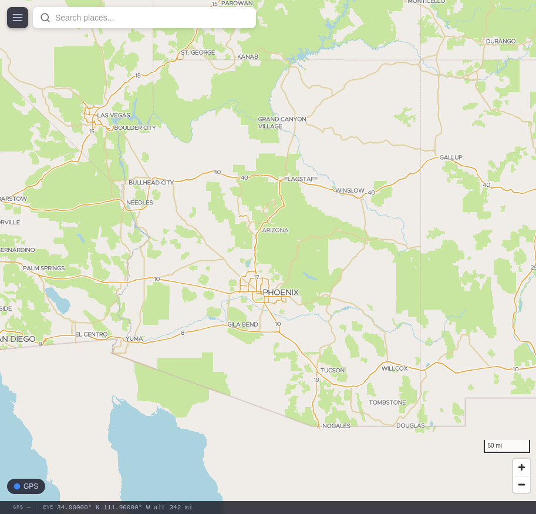
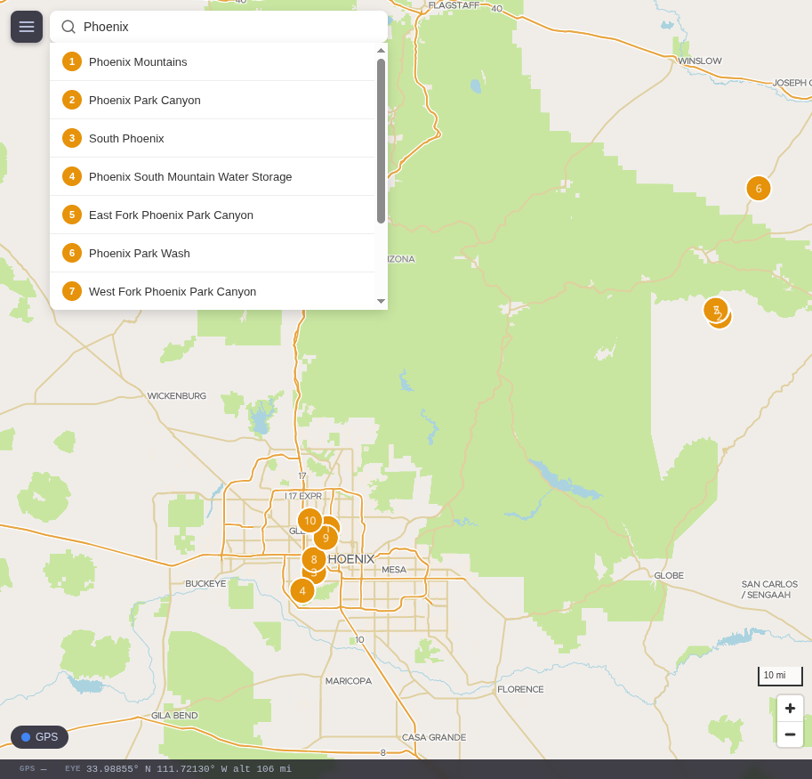

# README Validation Report — 2026-04-09 (quick)

**Duration:** ~25 minutes (excluding Docker image pull time)
**Container:** geographica-test (Debian 13 Trixie, arm64)
**Mode:** quick (bind-mounted host data)
**Container IP:** 10.144.126.38

## Results Summary

| Step | Description | Status | Notes |
|------|-------------|--------|-------|
| Prerequisites | apt install | PASS | `docker-compose-v2` package doesn't exist — see Finding #1 |
| 1. Clone | git clone | SKIP | Placeholder URL — used tarball copy. See Finding #2 |
| 2. Data dir | mkdir + symlink | PASS | |
| 3. Environment | .env config | PASS | HOST_IP requires container eth0 IP, not `hostname -I`. See Finding #3 |
| 4. OSM data | Bind-mounted | SKIP | |
| 5. Basemap | Bind-mounted | SKIP | southwest5.mbtiles is gitignored, needed separate bind-mount |
| 6. Elevation | Bind-mounted | SKIP | |
| 7. POI index | Bind-mounted | SKIP | |
| 7b. OSM POIs | Bind-mounted | SKIP | |
| 8. Fonts | Downloaded | PASS | |
| 8. Sprites | Git clone + copy | PARTIAL | `sprite*` files don't exist in upstream repos. See Finding #4 |
| 9. Vendor libs | npm pack | PASS | wget/curl/unzip needed but not listed in Prerequisites |
| 10. GPS | Override | PASS | Compose override needed to remove device mapping |
| 11. Build | docker compose build | PASS | All images built successfully |
| 11. Launch | docker compose up | PARTIAL | Nominatim dependency blocks stack. See Finding #5 |
| 12. Tileserver | curl health | PASS | |
| 12. Geocoding | curl search | FAIL | Nominatim still importing (expected in quick mode) |
| 12. Routing | curl route | PASS | Valhalla returned route with 1 leg |
| 12. Search | curl search | PASS | 10 results for "Grand Canyon" |
| 12. STT | curl health | PASS | CPU backend, base.en model |
| 12. Frontend | HTTP from host | PASS | HTML served, accessible via container IP |
| TLS | Self-signed | PASS | Certs generated, HTTPS works inside container (443 not routable from host — double NAT) |
| Screenshot: Map | Playwright | PASS | Positron tiles render with WebGL, city labels visible |
| Screenshot: Search | Playwright | PASS | "Phoenix" returns numbered pins + results dropdown |

## Steps Skipped (quick mode)

- Step 1: Git clone — used `git archive` tarball (README has placeholder URL)
- Step 4: OSM download — bind-mounted from host `/srv/geographica/data/pbf/`
- Step 5: Vector basemap — bind-mounted `tileserver/southwest5.mbtiles`
- Step 6: Elevation tiles — bind-mounted from host `/srv/geographica/data/elevation.mbtiles`
- Step 7: POI index — bind-mounted from host `/srv/geographica/data/poi.sqlite`
- Step 7b: OSM POI extraction — same poi.sqlite already includes OSM data

## README Findings

### Finding #1 (CRITICAL): Package `docker-compose-v2` does not exist in Debian 13

The Prerequisites section lists `docker-compose-v2` but this package does not exist in Debian 13 (Trixie). The correct package is `docker-compose`. The `docker compose` subcommand (v2 style) works correctly after installing `docker-compose`.

**Affected line:** README Prerequisites code block
**Fix:** Change `docker-compose-v2` to `docker-compose`

### Finding #2 (CRITICAL): Placeholder git clone URL

Step 1 uses `https://github.com/your-org/geographica.git` which is a placeholder. A first-time user will fail immediately at step 1.

**Affected line:** README Step 1 code block
**Fix:** Replace with real repository URL before release

### Finding #3 (MEDIUM): HOST_IP instructions ambiguous

Step 3 says "set HOST_IP to your Pi's LAN address." This is correct for a direct Pi deployment, but the instruction is ambiguous:
- `hostname -I` can return multiple IPs (Docker bridge first on some systems)
- In container environments, the "LAN address" concept needs clarification

**Fix:** Add: "Use the Pi's primary network interface IP (usually eth0 or wlan0). You can find it with `ip -4 addr show eth0 | grep inet`."

### Finding #4 (MEDIUM): Style sprite files don't exist in upstream repos

Step 8 instructs cloning positron-gl-style and dark-matter-gl-style repos and copying `sprite*` files. These files no longer exist in the upstream repos. The `cp positron-tmp/sprite* positron/` command fails silently with `cp: cannot stat`.

The `icons/` directories DO exist and copy successfully. The `style.local.json` files reference `{styleJsonFolder}/sprite` so TileServer will look for sprite files that don't exist for positron and darkmatter (hybrid has its own sprites committed to the repo).

**Impact:** Map icons may be missing on positron/darkmatter styles.
**Fix:** Either commit sprite files to the repo (like hybrid does), or generate them from the icons directory, or update style.local.json to not reference sprites.

### Finding #5 (HIGH): Nominatim `service_healthy` dependency blocks entire stack

The search service depends on Nominatim with `condition: service_healthy`. Frontend depends on search. This means **the frontend cannot start until Nominatim finishes importing**, which takes hours for even a single state.

In quick mode with pre-built data, Nominatim still needs to re-import because the Docker volume is fresh (the PostgreSQL data directory is a Docker volume, not the bind-mounted PBF).

**Impact:** Stack is unusable for hours on first deployment. Users see no frontend until Nominatim finishes.
**Fix:** Consider changing the dependency to `condition: service_started` so the frontend and search start immediately. Search can return results from GNIS/OSM POI databases while Nominatim imports. Geocoding will be unavailable until import completes, but the rest of the app works.

### Finding #6 (LOW): Missing prerequisites

The README Prerequisites section doesn't list `wget`, `curl`, or `unzip`, which are needed by later steps (font download, vendor library installation). These happen to be pre-installed on most Debian systems but are NOT present on the minimal Debian 13 LXC image.

**Fix:** Add `wget curl unzip` to the Prerequisites apt install command.

### Finding #7 (LOW): Read-only bind-mount incompatible with writable services

In quick mode, the bind-mounted data is read-only. Nominatim needs to `chown` files and Valhalla needs to write config. This required creating writable copies and a compose override — not documented anywhere.

**Impact:** Quick mode testing only. Not a README bug per se, but a harness limitation.

## Screenshots

## TLS Notes

- Self-signed TLS generated successfully via `scripts/generate_tls.sh`
- HTTPS works inside the container (`curl -k https://localhost/`)
- Port 443 is NOT routable from host through LXD bridge (Docker binds inside container network namespace)
- Playwright screenshots taken over HTTP (port 8093) from host
- Tailscale TLS not tested (requires manual auth)

## Environment Limitations

- **GPS:** No hardware, started in no-fix mode (expected). Required compose override to remove `/dev/ttyAMA0` device mapping.
- **Nominatim:** Importing from scratch despite pre-existing PBF. The PostgreSQL database is a Docker volume, not bind-mountable.
- **WebGL:** Renders correctly via system Chromium on Pi 5
- **HTTPS from host:** Not accessible through LXD bridge; used HTTP for Playwright
- **Hailo NPU:** Not available in container

## Verdict

**CONDITIONAL PASS** — The stack deploys and 6 of 7 services start successfully from README instructions. The map renders, search works, routing works, STT works. Two critical README bugs must be fixed before release:

1. `docker-compose-v2` → `docker-compose` (blocks prerequisites on Debian 13)
2. Placeholder git clone URL (blocks step 1)

The Nominatim dependency chain (Finding #5) is the biggest UX issue — first-time users wait hours with no visible frontend. Consider relaxing to `service_started`.
